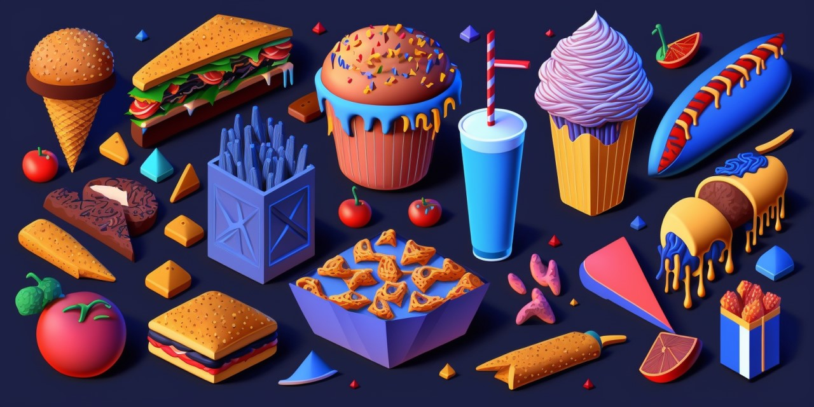

# IA Food Image Classifier

This is a proyect that I realize in the process of training for my TFG too, and I think it may be useful for someone to start learning how this things are about.

In addition, this was my first Machine Learning proyect, in which I learned the most. 

So let's start explaining the structure of the repo and how the program works.



## ¿Questions?

### ¿Where I found the dataset?
I found the **dataset** on -> https://data.vision.ee.ethz.ch/cvl/datasets_extra/food-101/

This is public University -> https://ethz.ch/en.html

On this **dataset** we can find 101 different ypes of food with 1000 images per categorie, this is a big **dataset** (5G).

### ¿How it works?
The principal program is **all based on python** and it is contained on a ``.ipnyb`` file which is a `jupiter notebook` format that can improve the understanding of the program, and its escalability.

On the `.ipnyb` file there is a explication of each part of the process.

### ¿What dependecies do the program use?
For this kind of proyects I always work with `python virtual envs` because it always has a problem with a specific dependecy or something like that. It is basically to prevent future conflicts of dependecies.

So in the repository I let a ``requirements.txt`` where you only need to do:
```Bash
pip install -r requirements.txt 
```

and that's all, I hope would be usefull :) !!

### Acknowledgements
The Food-101 data set consists of images from Foodspotting [1] which are not property of the Federal Institute of Technology Zurich (ETHZ). Any use beyond scientific fair use must be negociated with the respective picture owners according to the Foodspotting terms of use [2].
[1] http://www.foodspotting.com/
[2] http://www.foodspotting.com/terms/